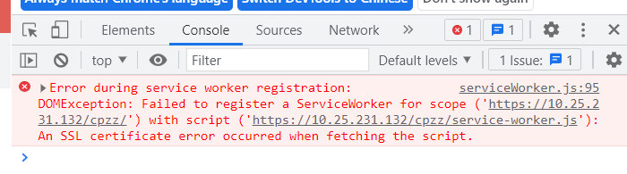

### 偶然有同事遇到<code>serviceWorker</code>的问题

先贴问题：
 

最初是有些懵逼的，所以去了解了一下<code>servicesWorker</code>

带着问题：  
1. <code>servicesWorker</code>是什么?
2. <code>servicesWorker</code>能干什么?
3. 怎么用<code>servicesWorker</code>?

### Google大法

相关连接：

[思否 service worker 是什么？看这篇就够了](https://segmentfault.com/a/1190000022103402)  
[阮一峰 service worker](https://www.bookstack.cn/read/webapi-tutorial/docs-service-worker.md)
[MDN 使用 service worker](https://developer.mozilla.org/zh-CN/docs/Web/API/Service_Worker_API/Using_Service_Workers)

1. <code>servicesWorker</code>是什么!
2. <code>servicesWorker</code>能干什么!

> 一个服务器与浏览器之间的中间人角色，如果网站中注册了service worker那么它可以拦截当前网站所有的请求，进行判断（需要编写相应的判断程序），如果需要向服务器发起请求的就转给服务器，如果可以直接使用缓存的就直接返回缓存不再转给服务器。从而大大提高浏览体验

3. 怎么用<code>servicesWorker</code>

(一). 注册
```
/** 注册Service worker: index.html */
if('serviceWorker' in navigator){
    window.addEventListener('load', function () {
        /* scope 参数是可选的，可以用来指定你想让 service worker 控制的内容的子目录。 在这个例子里，我们指定了 '/'，表示 根网域下的所有内容。这也是默认值。 */
        navigator.serviceWorker.register('./serviceWorker.js', {scope: './'}).then(function (registration) {
            console.log('ServiceWorker registration successful with scope: ', registration.scope);
        })
        .catch(function (err) {
            console.log('ServiceWorker registration failed: ', err);
        });
    });
}
```
> 上面代码的就是需要浏览器注册的 <code>service worker</code> 脚本。注意，这个脚本必须与当前网址同域，<code>service worker</code> 不支持跨与脚本。另外，<code>serviceWorker.js</code>必须是从<code> HTTPS</code> 协议加载的

由此可看出上面的问题！（证书过期）

（二）. 安装
```
/** serviceWorker.js */
self.addEventListener('install', event => {
  event.waitUntil(() => console.info('安装完成'))
})

```
(三). 激活
```
self.addEventListener('activate', (event) => {
    let cacheWhitelist = ['products-v2']
    event.waitUntil(
        caches.keys().then (cacheNames => {
            return Promise.all(
                cacheNames.map( cacheName => {
                    if (cacheWhitelist.indexOf(cacheName) === -1) {
                        return caches.delete(cacheName)
                    }
                })
            )
        })
    )
})

/** 通信 */
self.addEventListener('activate', (event) => {
    event.waitUntil(
        self.clients.matchAll().then ( (client) => {
            client.postMessage({
                msg: 'Hey, from service worker! I\'m listening to your fetch requests.',
                source: 'service-worker'
            })
        })
    )
})

/** 客户端接收 */
this.addEventListener('message', (data) => {
    if (data.source == 'service-worker') {
        console.log(data.msg)
    }
})
```
（四）使用
```
self.addEventListener('fetch', function(event) {
  event.respondWith(
    caches.match(event.request).then(function(resp) {
      return resp || fetch(event.request).then(function(response) {
        return caches.open('v1').then(function(cache) {
            //加入新的缓存
          cache.put(event.request, response.clone());
          return response;
        });
      });
    })
  );
});
```
### 注意
- Service worker运行在worker上下文 --> 不能访问DOM

- 它设计为完全异步，同步API（如XHR和localStorage）不能在service worker中使用

- 出于安全考量，Service workers只能由HTTPS承载

- 在Firefox浏览器的用户隐私模式，Service Worker不可用

- 其生命周期与页面无关（关联页面未关闭时，它也可以退出，没有关联页面时，它也可以启动）